# 📋 Task Manager App

A full-featured task management application built with Flutter, featuring user authentication, task CRUD operations, and a modern, responsive UI. This project was developed as part of an Ostad assignment to demonstrate real-world full-stack development skills.

## 📱 Screenshots

<table>
  <tr>
    <td align="center"><strong>Authentication Flow</strong></td>
    <td align="center"><strong>Task Management</strong></td>
    <td align="center"><strong>Status Updates</strong></td>
  </tr>
  <tr>
    <td>
      <br/>
      <em>Login Screen</em>
    </td>
    <td>
      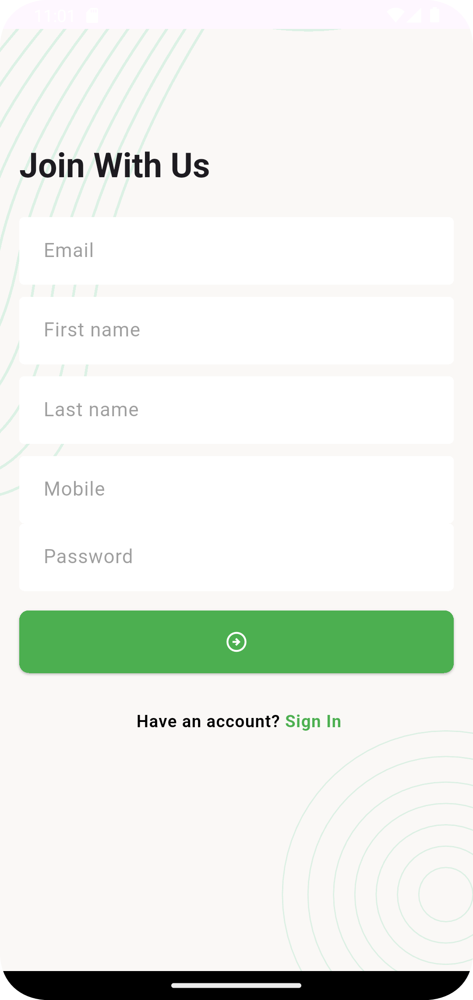<br/>
      <em>Sign Up Screen</em>
    </td>
    <td>
      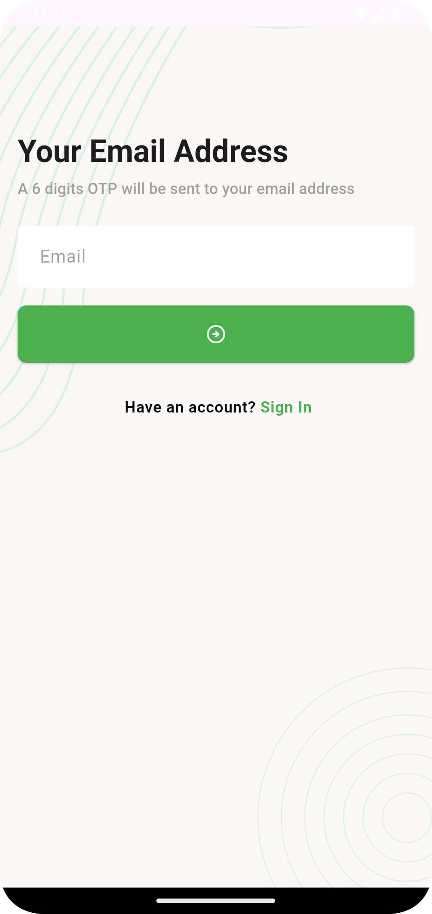<br/>
      <em>Email Verification</em>
    </td>
  </tr>
  <tr>
    <td>
      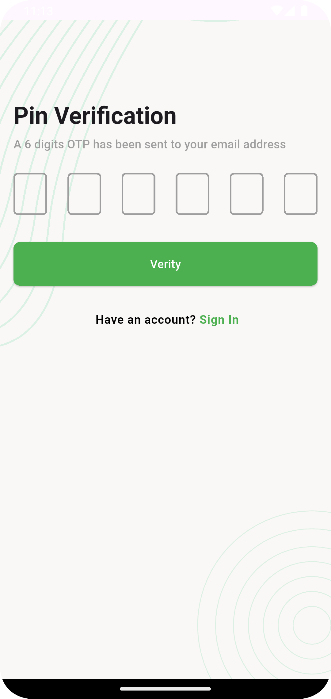<br/>
      <em>PIN Verification</em>
    </td>
    <td>
      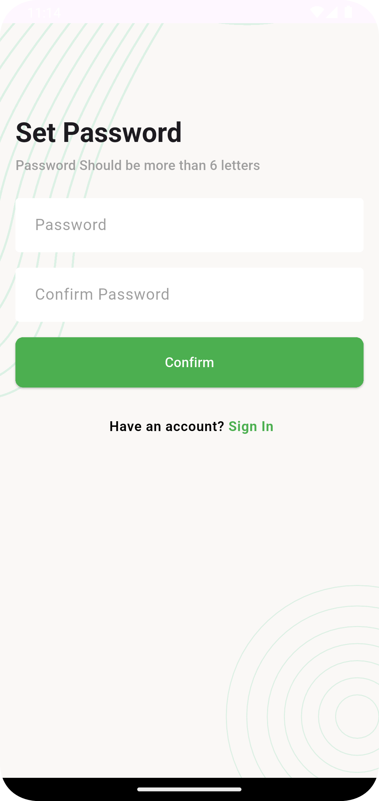<br/>
      <em>New Password Setup</em>
    </td>
    <td>
      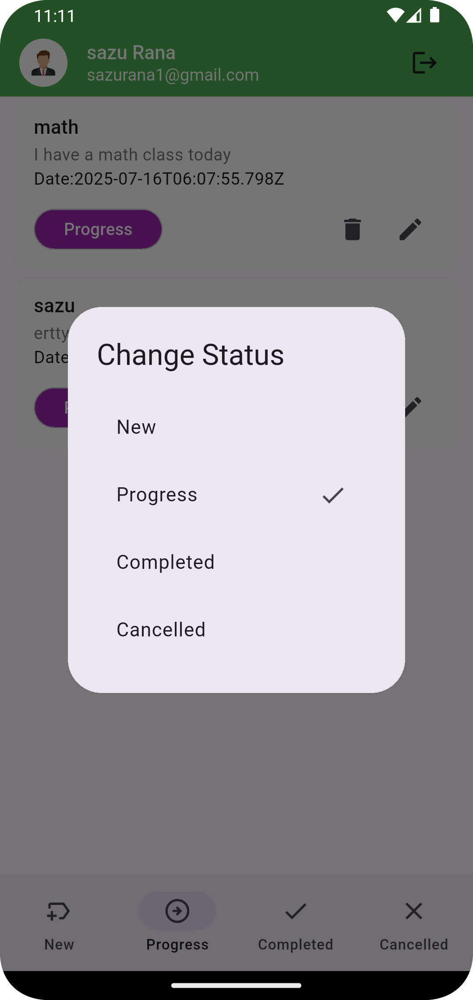<br/>
      <em>Status Options</em>
    </td>
  </tr>
  <tr>
    <td>
      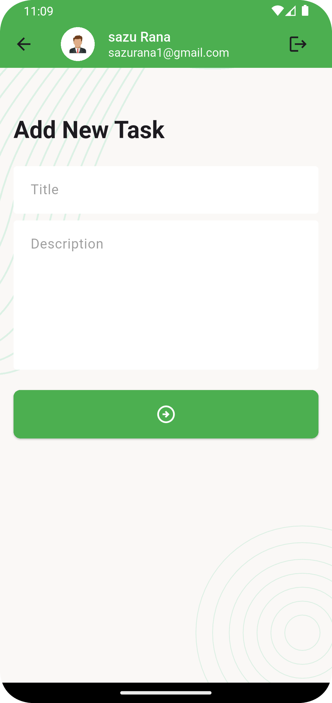<br/>
      <em>Add New Task</em>
    </td>
    <td>
      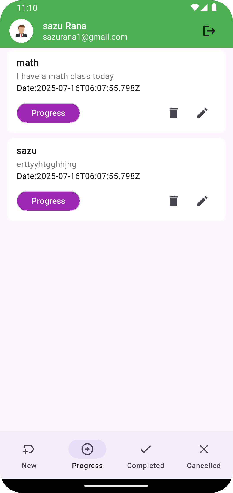<br/>
      <em>Progress Status</em>
    </td>
    <td>
      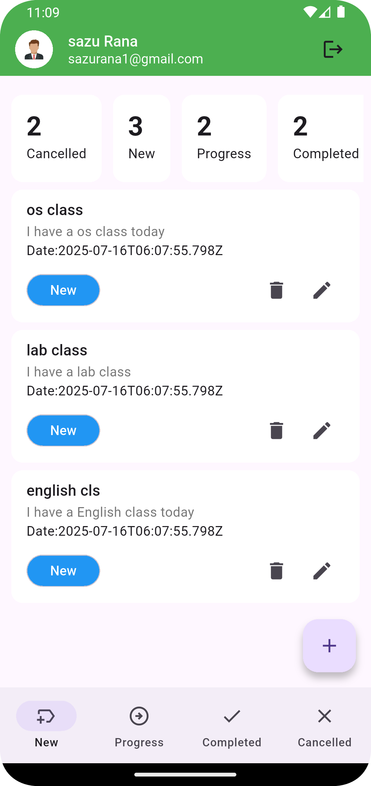<br/>
      <em>Task List View</em>
    </td>
  </tr>
  <tr>
    <td>
      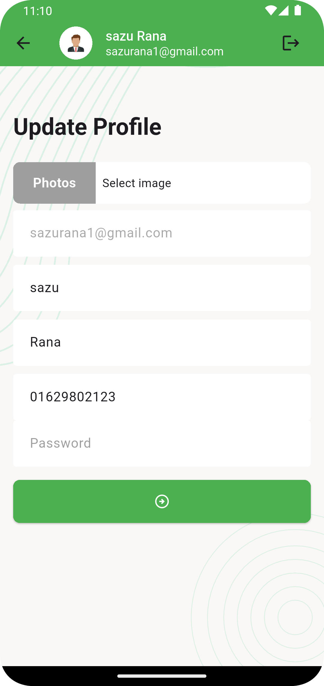<br/>
      <em>Update Profile</em>
    </td>
    <td>
      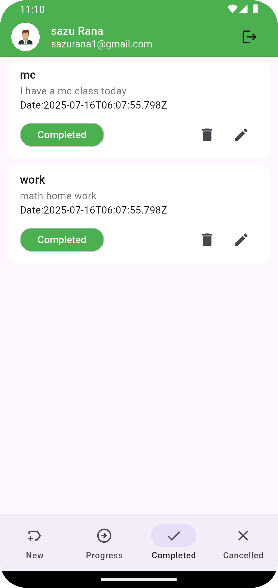<br/>
      <em>Completed Task</em>
    </td>
    <td>
      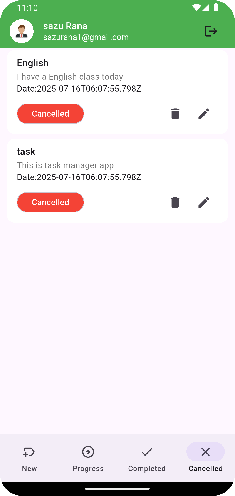<br/>
      <em>Cancelled Task</em>
    </td>
  </tr>
</table>

## ✨ Features

### 🔐 Authentication System
- **User Registration** - Complete sign-up flow with form validation
- **Secure Login** - Email/password authentication
- **Forgot Password** - Email-based password recovery
- **Email Verification** - 6-digit PIN verification system
- **Password Reset** - Secure password update functionality

### 📋 Task Management
- **Create Tasks** - Add new tasks with titles and descriptions
- **View Tasks** - Organized task dashboard with categorized views
- **Update Tasks** - Edit task details and modify content
- **Delete Tasks** - Remove unwanted tasks with confirmation
- **Status Management** - Track tasks through different states:
    - 🆕 New
    - ⏳ In Progress
    - ✅ Completed
    - ❌ Cancelled

### 🎨 User Experience
- **Modern UI Design** - Clean and intuitive interface
- **Responsive Layout** - Optimized for different screen sizes
- **Real-time Updates** - Instant task status changes
- **User-friendly Navigation** - Smooth transitions and interactions
- **Professional Styling** - Consistent color scheme and typography

- ## 📁 Project Structure

```
task_manager_app/
├───lib
│   │   app.dart
│   │   main.dart
│   │
│   ├───data
│   │   │   urls.dart
│   │   │
│   │   ├───models
│   │   │       reset_model.dart
│   │   │       task_model.dart
│   │   │       task_status_count_model.dart
│   │   │       user_model.dart
│   │   │
│   │   └───service
│   │           network_caller.dart
│   │
│   └───ui
│       ├───controllers
│       │       auth_controller.dart
│       │
│       ├───screens
│       │       add_new_task_screen.dart
│       │       cancelled_task_list_screen.dart
│       │       change_password.dart
│       │       completed_task_list_screen.dart
│       │       forgot_password_email_screen.dart
│       │       main_navigation_bar_screen.dart
│       │       new_task_list_screen.dart
│       │       pin_varification_screen.dart
│       │       progress_task_list_screen.dart
│       │       sign_in_screen.dart
│       │       sign_up_screen.dart
│       │       splash_screen.dart
│       │       update_profile_screen.dart
│       │
│       ├───utils
│       │       asset_paths.dart
│       │
│       └───widget
│               centered_circular_progress_indicator.dart
│               screen_background.dart
│               snackbar_massage.dart
│               task_card.dart
│               task_count_summary_card.dart
│               tm_app_bar.dart
