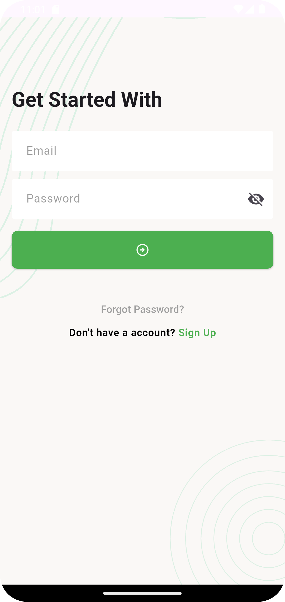

# 📋 Task Manager App

A full-featured task management application built with Flutter, featuring user authentication, task CRUD operations, and a modern, responsive UI. This project was developed as part of an Ostad assignment to demonstrate real-world full-stack development skills.

## 📱 Screenshots

<table>
  <tr>
    <td align="center"><strong>Authentication Flow</strong></td>
    <td align="center"><strong>Task Management</strong></td>
    <td align="center"><strong>Status Updates</strong></td>
  </tr>
  <tr>
    <td>
      <br/>
      <em>Login Screen</em>
    </td>
    <td>
      <br/>
      <em>Sign Up Screen</em>
    </td>
    <td>
      <br/>
      <em>Email Verification</em>
    </td>
  </tr>
  <tr>
    <td>
      <br/>
      <em>PIN Verification</em>
    </td>
    <td>
      <br/>
      <em>Password Setup</em>
    </td>
    <td>
      <br/>
      <em>Task Dashboard</em>
    </td>
  </tr>
  <tr>
    <td>
      <br/>
      <em>Add New Task</em>
    </td>
    <td>
      <br/>
      <em>Task List View</em>
    </td>
    <td>
      <br/>
      <em>Status Options</em>
    </td>
  </tr>
  <tr>
    <td>
      <br/>
      <em>In Progress Status</em>
    </td>
    <td>
      <br/>
      <em>Completed Task</em>
    </td>
    <td>
      <br/>
      <em>Cancelled Task</em>
    </td>
  </tr>
</table>

## ✨ Features

### 🔐 Authentication System
- **User Registration** - Complete sign-up flow with form validation
- **Secure Login** - Email/password authentication
- **Forgot Password** - Email-based password recovery
- **Email Verification** - 6-digit PIN verification system
- **Password Reset** - Secure password update functionality

### 📋 Task Management
- **Create Tasks** - Add new tasks with titles and descriptions
- **View Tasks** - Organized task dashboard with categorized views
- **Update Tasks** - Edit task details and modify content
- **Delete Tasks** - Remove unwanted tasks with confirmation
- **Status Management** - Track tasks through different states:
    - 🆕 New
    - ⏳ In Progress
    - ✅ Completed
    - ❌ Cancelled

### 🎨 User Experience
- **Modern UI Design** - Clean and intuitive interface
- **Responsive Layout** - Optimized for different screen sizes
- **Real-time Updates** - Instant task status changes
- **User-friendly Navigation** - Smooth transitions and interactions
- **Professional Styling** - Consistent color scheme and typography

- ## 📁 Project Structure

```
task_manager_app/
├── lib/
│   ├── main.dart                 # App entry point
│   ├── data/                     # Data-related files
│   │   ├── models/               # Data models
│   │   │   ├── task_status_count_model.dart
│   │   │   ├── task_model.dart
│   │   │   └── user_model.dart
│   │   ├── service/              # Service-related files
│   │   │   ├── network_caller.dart
│   │   │   └── urls.dart
│   ├── ui/                       # UI-related files
│   │   ├── controller/           # Controller files
│   │   │   └── auth_controller.dart
│   │   ├── screens/              # UI screens
│   │   │   ├── Forgot Password Screens/
│   │   │   │   ├── email_verification_screen.dart
│   │   │   │   ├── pin_verification_screen.dart
│   │   │   │   └── set_password_screen.dart
│   │   │   ├── add_task_screen.dart
│   │   │   ├── cancelled_task_list.dart
│   │   │   ├── completed_task_list.dart
│   │   │   ├── home_screen.dart
│   │   │   ├── new_task_screen.dart
│   │   │   ├── progress_task_screen.dart
│   │   │   ├── sign_in_screen.dart
│   │   │   ├── sign_up_screen.dart
│   │   │   ├── splash_screen.dart
│   │   │   └── update_profile_screen.dart
│   │   ├── widgets/              # Reusable widgets
│   │   │   ├── screen_background.dart
│   │   │   ├── snack_bar_message.dart
│   │   │   ├── task_app_bar.dart
│   │   │   ├── task_card.dart
│   │   │   └── task_summary_card.dart
│   ├── utils/                    # Utility files
│   │   └── assets_path.dart
├── assets/                       # Assets like images and fonts
└── pubspec.yaml                 # Dependencies
